<div align="center">

# 🤖 MockMate AI - Voice-First Interview Prep Platform


**The future of interview preparation is voice-first. Practice with an AI interviewer that listens, adapts, and challenges you in real-time.**

[🎯 Live Demo](https://mockmateai-eight.vercel.app/landingPage) • [🐛 Report Bug](https://github.com/iam-sarthakdev/MockMate-AI/issues) • [✨ Request Feature](https://github.com/iam-sarthakdev/MockMate-AI/issues)

[](https://github.com/iam-sarthakdev/MockMate-AI)

</div>

---

## 📌 Table of Contents
- [Overview](#-overview)
- [Features In-Depth](#-features-in-depth)
- [Tech Stack & Architecture](#-tech-stack--architecture-decisions)
- [Architecture](#-architecture)
- [Project Structure](#-project-structure)
- [Getting Started](#-getting-started)
- [Environment Configuration](#-environment-configuration)
- [Screenshots](#-screenshots)
- [Contributing](#-contributing)
- [License](#-license)
- [Author](#-author)

---

## 🎯 Overview

**MockMate AI** is a revolutionary interview preparation platform that transforms how developers practice for technical interviews. Unlike traditional text-based mock interviews or static question banks, MockMate AI provides a **voice-first, real-time conversational experience** powered by cutting-edge Voice AI technology.

### Why MockMate AI?

| Traditional Prep | MockMate AI |
|-----------------|-------------|
| ❌ Read questions, type answers | ✅ Speak naturally, get real-time feedback |
| ❌ No follow-up questions | ✅ Dynamic follow-ups based on your responses |
| ❌ Mechanical interview feel | ✅ Natural conversational flow |
| ❌ One interview style | ✅ Multiple modes: Behavioral, Technical, System Design |
| ❌ Generic difficulty | ✅ Adaptive Junior/Mid/Senior levels |

### What Makes It Special?

- **🗣️ Voice-First Experience**: Powered by VAPI's sub-second latency voice pipeline
- **🧠 Intelligent Adaptation**: AI interviewer adjusts questions based on your answers
- **🎭 Multiple Personas**: Different interview styles for different roles
- **📊 Real-Time Feedback**: Live audio visualization and response analysis
- **🎨 Premium UX**: Glassmorphic design with 60fps animations

---

## ✨ Features In-Depth

### 🗣️ **Real-Time Voice Interaction**

The heart of MockMate AI is its voice interaction system. Unlike text-based solutions, you speak naturally as you would in a real interview.

#### Voice Pipeline Architecture
```
Your Voice → VAPI SDK → WebSocket → AI Processing → Voice Response
                ↓              ↓            ↓
           Real-time      Low Latency   Natural Speech
           Streaming      (<500ms)      Generation
```

**Key Technical Details:**
- **Sub-second latency**: Responses feel natural, not robotic
- **Speech-to-Text**: Advanced transcription for accurate understanding
- **Text-to-Speech**: Natural-sounding AI voice responses
- **Interrupt handling**: You can interrupt just like in real conversations
- **Context awareness**: AI remembers previous answers in the conversation

---

### 🎯 **Multiple Interview Modes**

MockMate AI offers three distinct interview modes, each with specialized question banks and evaluation criteria.

#### 1️⃣ Behavioral Interviews

| Focus Area | Sample Questions | Evaluation Criteria |
|------------|------------------|---------------------|
| **Leadership** | "Tell me about a time you led a project through difficulties" | STAR method compliance |
| **Conflict Resolution** | "Describe a disagreement with a colleague" | Problem-solving approach |
| **Failure & Growth** | "Share a time you failed and what you learned" | Self-awareness & growth |
| **Teamwork** | "How do you handle a team member not pulling their weight?" | Collaboration skills |

**STAR Method Focus:**
- **S**ituation: Context setting
- **T**ask: Your responsibility
- **A**ction: Steps you took
- **R**esult: Measurable outcome

---

#### 2️⃣ Technical Interviews

Deep dive into core computer science concepts and coding challenges.

| Category | Topics Covered | Difficulty Levels |
|----------|---------------|-------------------|
| **Data Structures** | Arrays, Linked Lists, Trees, Graphs, Heaps | Easy → Hard |
| **Algorithms** | Sorting, Searching, Dynamic Programming | With follow-ups |
| **System Knowledge** | OS, Databases, Networking | Conceptual |
| **Language Specific** | JavaScript, Python, Java, C++ | Framework-aware |

---

#### 3️⃣ System Design Interviews

Architectural challenges for mid-to-senior level preparation.

| Design Challenge | Key Concepts | Discussion Points |
|-----------------|--------------|-------------------|
| **URL Shortener** | Hashing, Database design, Scaling | CAP theorem trade-offs |
| **Chat Application** | WebSockets, Message queues, Real-time | Presence handling |
| **Social Media Feed** | Caching, Fan-out, CDN | Content ranking |
| **Payment System** | ACID, Idempotency, Retry logic | Security considerations |

---

### 🎨 **Premium UI/UX Design**

MockMate AI features a modern, premium interface that makes interview prep feel less daunting.

#### Design System
```css
/* Core Design Tokens */
--glass-bg: rgba(255, 255, 255, 0.05);
--glass-border: rgba(255, 255, 255, 0.1);
--blur: backdrop-blur(16px);
--gradient-primary: linear-gradient(135deg, #6366f1, #8b5cf6);
```

#### Animation Philosophy
| Animation Type | Purpose | Implementation |
|---------------|---------|----------------|
| **Staggered Entry** | Progressive reveal | 100ms delay between elements |
| **3D Tilt Effects** | Interactive depth | Mouse-position-based transforms |
| **Hover States** | Feedback | Scale + glow transitions |
| **Audio Visualizer** | Real-time feedback | Canvas-based frequency bars |

---

### 📊 **Intelligent Question Selection**

The AI intelligently selects questions based on multiple factors.

#### Difficulty Adaptation

| Level | Question Depth | Follow-up Intensity | Expected Time |
|-------|---------------|---------------------|---------------|
| **Junior** | Fundamentals | Light probing | 3-5 min/question |
| **Mid** | Application | Moderate deep-dives | 5-7 min/question |
| **Senior** | Architecture | Heavy trade-off discussions | 7-10 min/question |

---

### 🔒 **Secure Authentication**

Robust user management powered by NextAuth.js with multiple provider support.

**Supported Providers:**
- 🐙 **GitHub**: Perfect for developers
- 🔵 **Google**: Universal access
- 📧 **Email/Password**: Traditional option

---

## 🛠 Tech Stack & Architecture Decisions

### **Why This Stack?**

| Technology | Why We Chose It | Benefit |
|------------|----------------|---------|
| **Next.js 14** | App Router + Server Components | Optimal performance, SEO |
| **TypeScript** | Type safety at scale | Fewer runtime errors |
| **VAPI** | Purpose-built for voice AI | Sub-second latency |
| **MongoDB** | Flexible schema | Easy to store varied interview data |
| **TailwindCSS** | Rapid styling | Consistent design system |
| **Framer Motion** | Declarative animations | Premium feel with minimal effort |

---

### **Frontend Technologies**

#### **Next.js 14** - Full-Stack Framework
- `app/` directory with nested layouts
- Server Components for initial data fetching
- Client Components for interactive elements
- API Routes for backend logic
- Middleware for auth protection

#### **TypeScript** - Type Safety
```typescript
interface InterviewSession {
  id: string;
  userId: string;
  mode: 'behavioral' | 'technical' | 'system-design';
  difficulty: 'junior' | 'mid' | 'senior';
  questions: Question[];
  startedAt: Date;
}
```

#### **Framer Motion** - Animations
- 3D Card Tilt Effects
- Staggered entry animations
- Audio visualization components

---

### **Backend Technologies**

#### **MongoDB** - Database
| Factor | MongoDB Advantage |
|--------|------------------|
| **Flexible Schema** | Interview sessions vary in structure |
| **JSON Storage** | Direct mapping to TypeScript objects |
| **Easy Scaling** | Built-in horizontal scaling |

**Collections:**
```
mockmate-ai-db/
├── users              # User accounts
├── interviews         # Session history
└── questions          # Question bank
```

---

### **Voice AI Integration**

#### **VAPI** - Voice AI Pipeline
```javascript
import Vapi from '@vapi-ai/web';

const vapi = new Vapi(process.env.NEXT_PUBLIC_VAPI_WEB_TOKEN);

await vapi.start({
  workflowId: process.env.NEXT_PUBLIC_VAPI_WORKFLOW_ID,
  variables: { mode: 'technical', difficulty: 'senior' }
});

vapi.on('speech-start', () => setIsSpeaking(true));
vapi.on('message', (msg) => updateTranscript(msg));
```

---

## 🏗 Architecture

```mermaid
graph TB
    subgraph "Client Layer"
        A[Next.js App] --> B[App Router]
        A --> C[Framer Motion]
        A --> D[TailwindCSS]
    end
    
    subgraph "Voice Layer"
        E[VAPI Web SDK] --> F[WebSocket Connection]
        F --> G[Speech-to-Text]
        F --> H[AI Processing]
        F --> I[Text-to-Speech]
    end
    
    subgraph "Auth Layer"
        J[NextAuth.js] --> K[JWT Tokens]
        J --> L[OAuth Providers]
    end
    
    subgraph "Data Layer"
        N[(MongoDB Atlas)] --> O[Users]
        N --> P[Interviews]
        N --> Q[Questions]
    end
    
    A --> E
    A --> J
    A --> N
    
    style A fill:#000000,stroke:#fff,stroke-width:2px
    style E fill:#6366f1,stroke:#fff,stroke-width:2px
    style N fill:#47A248,stroke:#fff,stroke-width:2px
```



## 📸 Screenshots

v


---

## 📁 Project Structure

```
MockMate-AI/
├── src/
│   ├── app/                    # Next.js App Router
│   │   ├── (auth)/            # Auth routes
│   │   ├── (main)/            # Main app routes
│   │   ├── api/               # API routes
│   │   └── landingPage/       # Public landing
│   │
│   ├── components/            # React Components
│   │   ├── Agent.tsx          # VAPI integration
│   │   ├── InterviewModeSelector.tsx
│   │   ├── AudioVisualizer.tsx
│   │   └── ui/                # Shared UI
│   │
│   ├── constants/             # Static Data
│   │   └── questions/         # Question banks
│   │
│   ├── lib/                   # Utilities
│   │   ├── db.ts              # MongoDB connection
│   │   └── auth.ts            # Auth utilities
│   │
│   ├── models/                # Mongoose Schemas
│   └── types/                 # TypeScript Interfaces
│
├── public/                    # Static assets
├── .env.local                 # Environment variables
└── package.json
```

---

## 🚀 Getting Started

### **Prerequisites**

| Requirement | Version | Purpose |
|-------------|---------|---------|
| **Node.js** | 18.x+ | Runtime environment |
| **MongoDB** | Atlas or Local | Database |
| **VAPI Account** | Free tier | Voice AI |

### **Installation**

```bash
# 1. Clone the repository
git clone https://github.com/iam-sarthakdev/MockMate-AI.git
cd MockMate-AI

# 2. Install dependencies
npm install

# 3. Set up environment variables
cp .env.example .env.local

# 4. Run development server
npm run dev
```

Open [http://localhost:3000](http://localhost:3000) in your browser.

---

## ⚙️ Environment Configuration

Create a `.env.local` file:

```bash
# Database
MONGODB_URI=mongodb+srv://<username>:<password>@cluster.mongodb.net/mockmate-ai

# NextAuth
NEXTAUTH_URL=http://localhost:3000
NEXTAUTH_SECRET=your-super-secret-random-string

# VAPI Voice AI
NEXT_PUBLIC_VAPI_WEB_TOKEN=your_vapi_public_key
NEXT_PUBLIC_VAPI_WORKFLOW_ID=your_vapi_workflow_id

# OAuth (Optional)
GITHUB_CLIENT_ID=your_github_client_id
GITHUB_CLIENT_SECRET=your_github_client_secret
GOOGLE_CLIENT_ID=your_google_client_id
GOOGLE_CLIENT_SECRET=your_google_client_secret
```

### Getting API Keys

| Service | Link |
|---------|------|
| **MongoDB Atlas** | [mongodb.com/atlas](https://www.mongodb.com/atlas) |
| **VAPI** | [vapi.ai](https://vapi.ai) |
| **GitHub OAuth** | [github.com/settings/developers](https://github.com/settings/developers) |
| **Google OAuth** | [console.cloud.google.com](https://console.cloud.google.com) |

---

## 📸 Screenshots

### 🏠 Landing Page
<div align="center">

</div>

*Premium landing page with compelling value proposition - Visit [Live Demo](https://mockmateai-eight.vercel.app/landingPage) to experience the full UI*

### 🎯 Interview Mode Selection
*3D card interface for selecting interview type (Behavioral/Technical/System Design)*

### 🎙️ Active Interview Session
*Voice-first interview with real-time audio visualization and AI responses*

### 📊 Dashboard
*User dashboard showing interview history and performance metrics*

> **Note**: To see the full experience, visit our [Live Demo](https://mockmateai-eight.vercel.app/landingPage)

---

## 🤝 Contributing

Contributions are welcome! 

```bash
# 1. Fork the Project
gh repo fork iam-sarthakdev/MockMate-AI

# 2. Create Feature Branch
git checkout -b feature/AmazingFeature

# 3. Commit Changes
git commit -m 'Add some AmazingFeature'

# 4. Push to Branch
git push origin feature/AmazingFeature

# 5. Open Pull Request
```

### Development Guidelines
- Use **TypeScript** with strict typing
- Follow existing **TailwindCSS** patterns
- Use **conventional commits**

---

## 📄 License

Distributed under the **MIT License**. See `LICENSE` for more information.

---

## 👤 Author

**Sarthak Dev**

| Platform | Link |
|----------|------|
| 🐙 **GitHub** | [@iam-sarthakdev](https://github.com/iam-sarthakdev) |
| 💼 **LinkedIn** | [Sarthak Dev](https://linkedin.com/in/sarthakdev) |
| 📧 **Email** | sarthak1712005@gmail.com |

---

## 🙏 Acknowledgments

- [VAPI](https://vapi.ai) - Voice AI platform
- [Next.js](https://nextjs.org) - React framework
- [Framer Motion](https://www.framer.com/motion/) - Animations
- [TailwindCSS](https://tailwindcss.com) - Styling
- [MongoDB](https://www.mongodb.com) - Database

---

<div align="center">

### ⭐ Found this project helpful? Give it a star!

**Transform your interview preparation with voice-first AI practice.**

Made with ❤️ by [Sarthak Dev](https://github.com/iam-sarthakdev)

[🎯 Try Live Demo](https://mockmateai-eight.vercel.app/landingPage) | [📂 View Repository](https://github.com/iam-sarthakdev/MockMate-AI)

</div>
